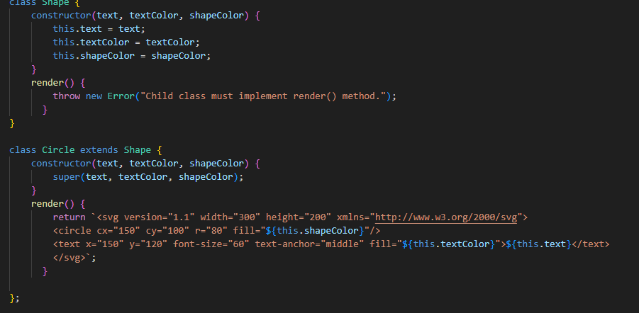

# Logo Generator 

## Description
This application runs in the console and generates a logo.svg file based on your answers to specific questions. You can input up to three letters for the text content and then choose between a triangle, circle, or square. Additionally, you have options to customize the shape and text colors to your preference. 

  <svg version="1.1" width="300" height="200" xmlns="http://www.w3.org/2000/svg">  
          <circle cx="150" cy="100" r="80" fill="red"/>
          <text x="150" y="120" font-size="60" text-anchor="middle" fill="white">DGG</text>
          </svg>

          Example of a circle logo 
                       
[Watch Demo Video](https://watch.screencastify.com/v/lSkUHjUZsqOBTfZKR6Io)

## Installation
To use this application, you need to have Node.js, Inquirer, and Jest installed.
- [node.js](https://nodejs.org/en) Install the LTS version
- [Inquirer](https://www.npmjs.com/package/inquirer#documentation) Use version 8.2.4
- [Jest](https://jestjs.io/docs/getting-started)

## Usage
Open the terminal and type 'node index.js' to initiate the generator. Answer the questions it asks you and when your done it will generate the logo.svg file in the assets directory. To run the tests type npm run test in the terminal.

*Example of the shape tests*

*Terminal after all questions are answered*

## Code Highlights

*Inquirer question prompts*

*How the data captured with inquirer is rendered to the logo.svg*

*Example of one of the shape classes*

## License
This project is licensed under the [MIT License](LICENSE).

## Questions

[My GitHub Profile](https://github.com/Andrewchall92)

